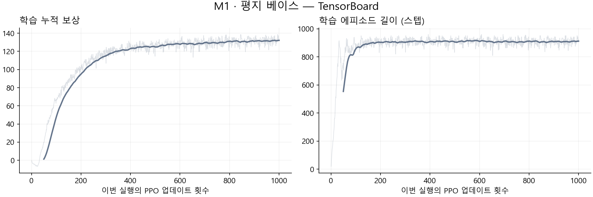
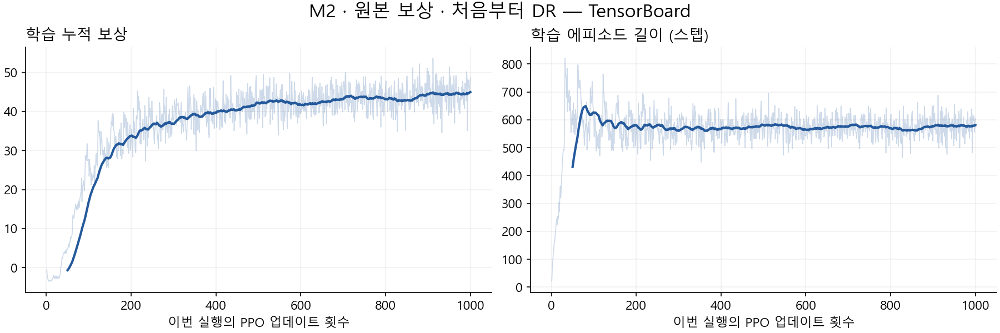
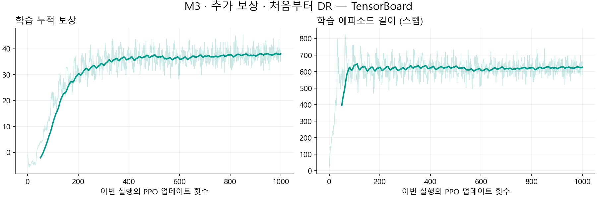
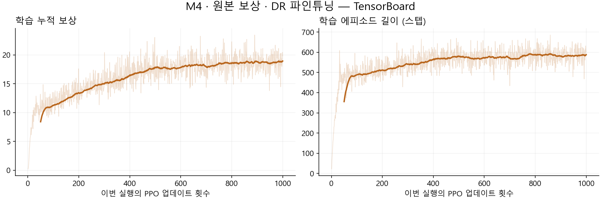
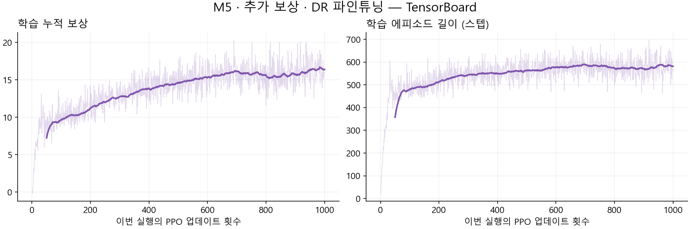
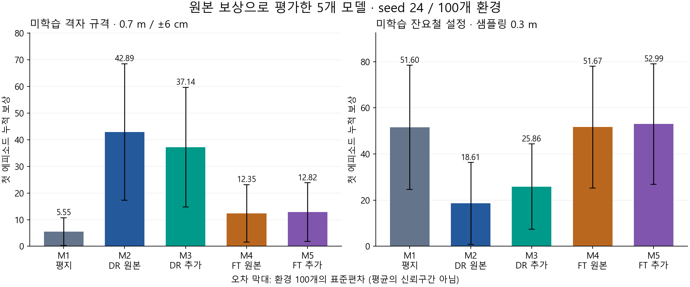

# 실습 과제 1 — 처음 보는 환경에서도 잘 걷는 Ant 만들기

**평지 베이스 · 처음부터 DR 학습 · DR 파인튜닝: 5개 모델의 사각 격자·잔요철 평가**  
최종 갱신: 2026년 10월 6일 · 평가 기록 `ant_eval_grid_rough_video_20261006_045015` 기준  
[외부 공유 보고서](https://ant-robustness-assignment1.dhalstjr5247.chatgpt.site)

> **핵심 결과:** 미학습 격자 규격에서는 원본 보상으로 처음부터 DR 학습한 M2가 42.8943으로 가장 높았다. 미학습 잔요철 설정에서는 추가 보상으로 파인튜닝한 M5가 52.9879로 가장 높았으나, 평지 베이스 51.6015 대비 차이는 약 2.7%였다. 지형에 따라 학습 방식과 추가 보상의 효과가 달랐다.

## 1. 연구개요

### 연구 목적

평지에서 잘 걷는 Ant가 지면의 높이·형태와 마찰이 달라져도 전진할 수 있는지 확인한다. 환경 변화에 대한 강건성을 높이는 방법으로 **환경 도메인 랜덤화(DR), 평지 사전학습 후 파인튜닝, 보상함수 설계**를 비교한다.

비교 모델은 평지 베이스 1개, 혼합 지형에서 처음부터 학습한 원본/추가 보상 모델 2개, 같은 평지 베이스에서 독립적으로 파인튜닝한 원본/추가 보상 모델 2개로 총 다섯 개다.

로봇의 링크 길이·관절 개수·USD 하드웨어 구조, 관측 차원과 신경망 구조는 변경하지 않았다. 발 들기 높이 보상과 별도의 센서 추가는 이번 실험에 포함하지 않았다.

### 이번 평가에서 ‘학습하지 않은 환경’의 의미

| 평가 지형 | DR 학습 설정 | 이번 평가 설정 | 일반화 대상 |
|---|---|---|---|
| 사각 격자 | 칸 너비 0.6 m, 높이 ±6 cm, 지형 seed 1701 | **칸 너비 0.7 m**, 높이 ±6 cm, 지형 seed 2403 | 새로운 격자 규격·배치 |
| 불규칙 잔요철 | 높이 샘플링 간격 0.4 m, 높이 잡음 설정 ±2.5 cm, 지형 seed 1701 | **샘플링 간격 0.3 m**, 높이 잡음 설정 ±2.5 cm, 지형 seed 2405 | 새로운 공간 샘플링 설정·배치 |

**사각 격자와 잔요철이라는 종류 자체는 DR 학습에 포함됐다.** 이번 평가는 같은 종류 안에서 학습에 사용하지 않은 규격·배치로의 일반화를 측정한다. 완전히 새로운 지형 종류에 대한 검증으로 표현하지 않는다. 평지 베이스 M1은 두 종류 모두 학습하지 않았다.

잔요철은 `HfRandomUniformTerrainCfg`로 무작위 높이를 샘플링한 뒤 사이를 보간한 불규칙한 지면이다. 주기적인 굴곡을 만드는 `HfWaveTerrainCfg`의 물결과 다르다. ±2.5 cm는 샘플 높이의 잡음 설정이며, 보간 후 표면의 모든 점에 대한 엄격한 상·하한을 뜻하지 않는다.

이전 격자·물결 평가는 별도 원자료로 보존했다. 본문 표와 그래프·영상은 **이번 격자·잔요철 평가만 사용**한다. 서로 다른 지형의 원점수를 단순 합산하지 않고 같은 지형 안에서 모델을 비교한다.

## 2. 연구가설

| 번호 | 모델 | 초기 정책 | 학습 보상 | 총 학습량 |
|---|---|---|---|---:|
| M1 | 평지 베이스 | 무작위 초기화 | 원본 7개 | 평지 1,000회 |
| M2 | 원본 보상 · 처음부터 DR | 무작위 초기화 | 원본 7개 | DR 1,000회 |
| M3 | 추가 보상 · 처음부터 DR | 무작위 초기화 | 원본 7개 + 벌점 4개 | DR 1,000회 |
| M4 | 원본 보상 · DR 파인튜닝 | M1 | 원본 7개 | 평지 1,000 + DR 1,000회 |
| M5 | 추가 보상 · DR 파인튜닝 | M1 | 원본 7개 + 벌점 4개 | 평지 1,000 + DR 1,000회 |

- **H1 — 환경 다양화:** 혼합 지형과 마찰 변화에 노출되면 평지 학습보다 새로운 지형 설정에서 성능이 향상될 것이다. 같은 학습량인 M1/M2와, 추가 적응을 수행한 M1/M4를 구분해 비교한다.
- **H2 — 학습 출발점:** 평지 정책을 출발점으로 삼는 것과 처음부터 DR 학습하는 것은 서로 다른 일반화 특성을 보일 것이다. M2/M4, M3/M5를 비교하되 총 학습량 차이를 함께 고려한다.
- **H3 — 보상 설계:** 몸통의 상하·좌우 움직임, 롤·피치 회전과 방향 오차 벌점을 추가하면 새로운 지형 설정에서 성능이 향상될 것이다. 같은 학습 방식 안에서 M2/M3, M4/M5를 비교한다.

M4/M5는 **동일한 M1 체크포인트에서 각각 독립적으로 시작**했다. M5가 M4의 학습 결과를 이어받은 것은 아니다. M2/M3 및 M4/M5는 각 쌍 안에서 환경·학습 seed·PPO 설정·업데이트 수가 같고 보상 구성이 다르다.

## 3. Training 및 Rollout

### 3.1 컴퓨터 사양 및 주요 라이브러리

| 항목 | 사양·버전 |
|---|---|
| 운영체제 | Ubuntu 22.04.5 LTS, x86_64 |
| CPU | Intel Xeon Gold 5512U, 28코어 / 56스레드 |
| 메모리 | OS에서 인식한 총 메모리 약 251 GiB |
| GPU | NVIDIA RTX 6000 Ada Generation, 48 GB급 VRAM (`nvidia-smi`: 49,140 MiB) |
| NVIDIA 드라이버 | 580.178.04 |
| CUDA Toolkit / PyTorch CUDA 런타임 | 12.8 (`nvcc` 12.8.61) / 12.8 |
| Python / Conda 환경 | 3.11.16 / `lerobot-arena` |
| Isaac Sim | 5.1.0.0 |
| Isaac Lab 저장소 | `VERSION` 기준 2.3.0 |
| Isaac Lab 패키지 | `isaaclab` 0.47.2, `isaaclab_tasks` 0.11.6, `isaaclab_rl` 0.4.4 |
| PyTorch / torchvision | 2.7.0+cu128 / 0.22.0+cu128 |
| RSL-RL / Gymnasium | 3.0.1 / 1.2.0 |
| TensorBoard / NumPy | 2.21.0 / 1.26.0 |
| Hydra / Warp | 1.3.7 / 1.17.0 |

버전은 보고서 작성 시 실제 설치 환경에서 확인했다. `nvidia-smi`의 CUDA 13.0 표시는 드라이버 지원 상한이며, 사용 중인 Toolkit·PyTorch 런타임은 12.8이다. 과거 평지 학습 시점의 전체 패키지 스냅샷을 별도로 남긴 것은 아니다.

### 3.2 공통 실험 설정

#### 학습과 도메인 랜덤화

| 설정 | 값 |
|---|---|
| 학습 환경 수 / seed | 4,096 / 42 |
| 각 실행의 학습량 | 1,000 PPO 업데이트 |
| 업데이트당 수집량 | 환경당 32스텝, 총 131,072 transition |
| 각 1,000회 실행의 수집량 | 131,072,000 transition |
| Actor / Critic | 각각 은닉층 400–200–100, ELU |
| 관측 / 행동 | 60차원 / 관절 effort 8차원 |
| PPO | 초기 learning rate 0.0005, adaptive, 5 epochs, 4 minibatches |
| 할인율 / GAE λ / PPO clip | 0.99 / 0.95 / 0.2 |
| 물리 / 제어 주기 | 1/120초 / 1/60초 |
| 최대 에피소드 | 16초 = 960 제어 스텝 |
| 외란 | 없음 |

| DR 학습 지형 | 생성 확률 | 설정 |
|---|---:|---|
| 평지 | 10% | `MeshPlaneTerrainCfg` |
| 불규칙 잔요철 | 30% | 높이 ±2.5 cm, 높이 간격 0.5 cm, 공간 샘플링 0.4 m |
| 사각 격자 | 40% | `MeshRandomGridTerrainCfg`, 칸 0.6×0.6 m, 높이 −6~+6 cm |
| 경사 | 10% | slope 파라미터 0.02~0.10 |
| 역경사 | 10% | 같은 범위의 반대 경사 |

DR 학습 지형은 seed 1701로 생성한 20×20 m 타일 16×16개, 총 320×320 m다. 비율은 타일 생성 확률이며, 실제 타일 개수나 로봇의 경험 시간 비율을 보장하지 않는다. 지형을 매 스텝 또는 리셋마다 다시 생성하지 않는다. 격자는 `holes=False`, 중앙 플랫폼 폭 2 m를 사용하며, 인접 칸 단차는 최대 약 12 cm다. slope 값의 단위는 도(degree)가 아니다.

M2~M5의 로봇별 마찰은 정지 마찰 0.5~1.25, 동적 마찰 0.4~1.0에서 배정하고 동적 마찰이 정지 마찰보다 크지 않도록 한다. 64개 후보 중 배정하며 리셋 간 유지한다. 지면 마찰 1.0, 결합 방식 `average`를 사용한다. M1은 원본 평지 설정으로 학습했다.

#### 보상 설계 — 실제 학습 YAML 기준

| 원본 보상 항목 | 가중치 | 역할 |
|---|---:|---|
| progress | +1.0 | 목표까지의 거리 감소 |
| alive | +0.5 | 종료되지 않은 상태 유지 |
| upright | +0.1 | 몸통 수직 정렬, 투영값 기준 0.93 |
| move_to_target | +0.5 | 몸통 정면과 목표 방향 정렬, 투영값 기준 0.8 |
| action_l2 | −0.005 | 큰 행동 명령 억제 |
| energy | −0.05 | 행동·관절 속도 기반 에너지 사용 대용 지표 |
| joint_pos_limits | −0.1 | 관절 한계 근처 사용 억제 |

M3/M5의 추가 벌점은 다음과 같다. **이번 결과는 수직 속도 −0.05, 방향 오차 −0.1로 완화한 모델**이다. 이전 −0.5/−1.0 모델의 결과와 혼합하지 않는다.

| 추가 항목 | 식·가중치 | 의도 |
|---|---|---|
| 수직 속도 | `−0.05 × v_z_world²` | 몸통의 과도한 상하 움직임 억제 |
| 롤·피치 각속도 | `−0.05 × (ω_x_body² + ω_y_body²)` | 몸통 회전 흔들림 억제 |
| 좌우 속도 | `−0.05 × v_y_body²` | 몸통 좌우 움직임 억제 |
| 방향 오차 | `−0.1 × (1 − cos(목표 방위각 − 몸통 yaw))` | 목표 방향 정렬 유도 |

RewardManager는 각 항목의 가중치와 제어 시간 간격을 곱한다. 원본에도 방향 보상이 있으므로 보행 모양을 ‘방향 보상이 없어서’라고 설명하지 않는다. 벌점 추가가 특정 발 궤적이나 보행 형태를 보장하는 것은 아니다.

#### 평가·영상 조건

- 공식 `scripts/reinforcement_learning/rsl_rl/play_one_episode.py`를 사용했으며, 모든 모델에 **원본 7개 보상만 적용**했다.
- 공통 CLI: **`--seed 24 --num_envs 100`**, 외란 없음, 기본 로봇 배치 간격 5 m. 평가 마찰 랜덤화 범위는 위 DR 설정과 같다.
- 격자: `Isaac-Ant-DR-Eval-Blocks-v0`, 지형 seed 2403, 칸 너비 0.7 m, 높이 ±6 cm, 격자 100%.
- 잔요철: `Isaac-Ant-DR-v0`에서 평지·경사·역경사 비율을 0, 잔요철 비율을 1로 지정했다. 지형 seed 2405, `noise_range=(-0.025, 0.025)`, `noise_step=0.005`, `downsampled_scale=0.3`, 잔요철 100%다.
- CLI seed 24와 지형 생성 설정의 seed는 별개다. 지형별로 다섯 모델에 같은 설정을 적용했다.
- 각 로봇의 **첫 에피소드만 종료 스텝까지 포함**했다. mean/std는 100개 누적 보상의 평균/모집단 표준편차다. std는 평균의 신뢰구간이 아니다.
- 10개 평가 모두 실제 환경 수 100개, `Completed first episodes: 100/100`, 원본 보상 7개를 로그에서 확인했다. 이는 통계 수집 완료이며 성공률 100%를 뜻하지 않는다.

원본 평가 폴더는 `logs/ant_eval_grid_rough_video_20261006_045015`다. **사용자가 실행한 로그를 직접 집계**했으며 보고서 작성을 위해 재평가하지 않았다. 평가에 사용한 모델 사본 해시가 각 학습 체크포인트와 일치한다. 격자의 설정은 이전 평가와 같고, 다섯 모델의 보상·스텝 mean/std가 로그의 소수점 6자리까지 동일하게 재현됐다.

영상 10개는 모두 1280×720, 60fps, 960프레임(16초)이다. 카메라는 0번 로봇을 따라간다. 그 로봇이 일찍 종료되면 자동 리셋 이후 장면도 포함되므로, 영상 길이는 생존 시간이 아니다. 한 로봇의 영상이 환경 100개를 대표하지 않는다.

TensorBoard 그래프는 실제 학습 이벤트 파일에서 추출했다. 얇은 선은 원 로그, 굵은 선은 50회 이동평균이고, 표는 평활화 전 처음/마지막 100회 평균이다. 가로축은 해당 실행의 업데이트 1~1,000회이며 파인튜닝 이전의 평지 학습을 포함하지 않는다. 학습 지형과 보상 정의가 다른 모델의 학습 누적 보상을 성능 순위로 직접 비교하지 않는다.

### 3.3 M1 — 평지 베이스

체크포인트: `logs/rsl_rl/ant/2026-09-17_13-21-32_ant_baseline/model_999.pt`



| 학습 지표 | 처음 100회 평균 | 마지막 100회 평균 |
|---|---:|---:|
| 학습 누적 보상 | 24.3946 | 131.8703 |
| 에피소드 길이 (스텝) | 704.9865 | 910.8404 |
| 진행 보상 성분 (에피소드 누적 / 16초) | 1.6220 | 8.3838 |

| 평가 지형 | 보상 평균 ± 표준편차 | 에피소드 길이 평균 ± 표준편차 (스텝) |
|---|---:|---:|
| 사각 격자 | 5.546510 ± 5.197220 | 439.32 ± 357.87 |
| 잔요철 | 51.601512 ± 26.924326 | 733.25 ± 325.76 |

격자 평균 보상은 5.5465로 가장 낮았다. 잔요철은 51.6015로, 잔요철을 직접 학습하지 않았음에도 M2/M3보다 높고 M4와 비슷했다. 평지에서 얻은 정책의 일반화 성능이 지형 설정에 따라 달랐다.

[M1 사각 격자 평가 영상](assets/rollout_M1_grid.mp4)

[M1 잔요철 평가 영상](assets/rollout_M1_rough.mp4)


### 3.4 M2 — 원본 보상 · 처음부터 DR

체크포인트: `logs/rsl_rl/ant/2026-10-06_02-01-31_scratch_rough_blocks_original/model_999.pt`



| 학습 지표 | 처음 100회 평균 | 마지막 100회 평균 |
|---|---:|---:|
| 학습 누적 보상 | 8.1401 | 44.6866 |
| 에피소드 길이 (스텝) | 528.9255 | 579.7731 |
| 진행 보상 성분 (에피소드 누적 / 16초) | 0.4504 | 2.7769 |

| 평가 지형 | 보상 평균 ± 표준편차 | 에피소드 길이 평균 ± 표준편차 (스텝) |
|---|---:|---:|
| 사각 격자 | 42.894314 ± 25.629163 | 685.78 ± 358.47 |
| 잔요철 | 18.609978 ± 17.772745 | 362.89 ± 271.63 |

격자 평균 보상은 42.8943으로 가장 높았고 M1의 약 7.73배였다. 잔요철은 18.6100으로 가장 낮아 M1보다 약 63.9% 낮았다. 학습에 잔요철도 포함됐지만 그 사실만으로 새 잔요철 설정에서 높은 성능이 보장되지는 않았다.

[M2 사각 격자 평가 영상](assets/rollout_M2_grid.mp4)

[M2 잔요철 평가 영상](assets/rollout_M2_rough.mp4)


### 3.5 M3 — 추가 보상 · 처음부터 DR

체크포인트: `logs/rsl_rl/ant/2026-10-06_02-21-55_scratch_rough_blocks_light/model_999.pt`



| 학습 지표 | 처음 100회 평균 | 마지막 100회 평균 |
|---|---:|---:|
| 학습 누적 보상 | 4.6769 | 38.0231 |
| 에피소드 길이 (스텝) | 517.7339 | 626.4574 |
| 진행 보상 성분 (에피소드 누적 / 16초) | 0.2924 | 2.4069 |

| 평가 지형 | 보상 평균 ± 표준편차 | 에피소드 길이 평균 ± 표준편차 (스텝) |
|---|---:|---:|
| 사각 격자 | 37.144177 ± 22.444523 | 712.65 ± 365.67 |
| 잔요철 | 25.857550 ± 18.519332 | 534.25 ± 329.79 |

M2 대비 격자 보상은 13.4% 낮고 잔요철은 38.9% 높았다. 잔요철 평균 에피소드 길이는 362.89→534.25스텝으로 늘었다. 다만 잔요철 보상 25.8576은 평지 베이스보다 낮았고, 추가 보상의 이점이 두 지형에 일관되게 나타난 것은 아니다.

[M3 사각 격자 평가 영상](assets/rollout_M3_grid.mp4)

[M3 잔요철 평가 영상](assets/rollout_M3_rough.mp4)


### 3.6 M4 — 원본 보상 · DR 파인튜닝

체크포인트: `logs/rsl_rl/ant/2026-10-05_21-47-43_baseline_ft_rough_blocks_original/model_1998.pt`



| 학습 지표 | 처음 100회 평균 | 마지막 100회 평균 |
|---|---:|---:|
| 학습 누적 보상 | 9.8183 | 18.7296 |
| 에피소드 길이 (스텝) | 421.9205 | 584.8142 |
| 진행 보상 성분 (에피소드 누적 / 16초) | 0.6422 | 1.1890 |

| 평가 지형 | 보상 평균 ± 표준편차 | 에피소드 길이 평균 ± 표준편차 (스텝) |
|---|---:|---:|
| 사각 격자 | 12.351667 ± 10.774248 | 619.52 ± 385.79 |
| 잔요철 | 51.667219 ± 26.397485 | 725.68 ± 317.62 |

격자 평균 보상은 M1의 약 2.23배로 개선됐다. 잔요철은 51.6672로 M1의 51.6015와 거의 같았다(+0.13%). 이번 조건에서 파인튜닝은 평지 기반 정책의 잔요철 성능을 대체로 유지하면서 격자 성능을 개선했다.

[M4 사각 격자 평가 영상](assets/rollout_M4_grid.mp4)

[M4 잔요철 평가 영상](assets/rollout_M4_rough.mp4)


### 3.7 M5 — 추가 보상 · DR 파인튜닝

체크포인트: `logs/rsl_rl/ant/2026-10-05_23-50-19_baseline_ft_rough_blocks_light/model_1998.pt`



| 학습 지표 | 처음 100회 평균 | 마지막 100회 평균 |
|---|---:|---:|
| 학습 누적 보상 | 8.4674 | 16.3515 |
| 에피소드 길이 (스텝) | 419.2527 | 583.3942 |
| 진행 보상 성분 (에피소드 누적 / 16초) | 0.6437 | 1.1886 |

| 평가 지형 | 보상 평균 ± 표준편차 | 에피소드 길이 평균 ± 표준편차 (스텝) |
|---|---:|---:|
| 사각 격자 | 12.816671 ± 11.009050 | 573.42 ± 386.33 |
| 잔요철 | 52.987868 ± 26.101945 | 751.68 ± 309.33 |

격자 12.8167, 잔요철 52.9879로 M4보다 각각 3.8%, 2.6% 높았다. 잔요철 평균은 가장 높지만 M1 대비 향상은 약 2.7%다. 단일 학습·평가 seed 결과이므로 작은 평균 차이를 확정적 우위로 해석하지 않는다.

[M5 사각 격자 평가 영상](assets/rollout_M5_grid.mp4)

[M5 잔요철 평가 영상](assets/rollout_M5_rough.mp4)

### 3.8 결과 종합 및 가설 검토

| 모델 | 격자 보상 평균 ± 표준편차 | 잔요철 보상 평균 ± 표준편차 | 격자 평균 지속 시간 | 잔요철 평균 지속 시간 |
|---|---:|---:|---:|---:|
| M1 · 평지 베이스 | 5.5465 ± 5.1972 | 51.6015 ± 26.9243 | 7.32초 | 12.22초 |
| M2 · 원본 보상 · 처음부터 DR | 42.8943 ± 25.6292 | 18.6100 ± 17.7727 | 11.43초 | 6.05초 |
| M3 · 추가 보상 · 처음부터 DR | 37.1442 ± 22.4445 | 25.8575 ± 18.5193 | 11.88초 | 8.90초 |
| M4 · 원본 보상 · DR 파인튜닝 | 12.3517 ± 10.7742 | 51.6672 ± 26.3975 | 10.33초 | 12.09초 |
| M5 · 추가 보상 · DR 파인튜닝 | 12.8167 ± 11.0091 | 52.9879 ± 26.1019 | 9.56초 | 12.53초 |



지속 시간은 평균 스텝 수 × 1/60초다. 정지해 있는 시간도 포함되므로 계속 전진한 시간으로 해석하지 않는다.

| 비교 | 격자 평균 보상 변화 | 잔요철 평균 보상 변화 |
|---|---:|---:|
| M1 → M2: 같은 1,000회, 평지 → DR | +673.36% | -63.94% |
| M1 → M4: 원본 보상 파인튜닝 추가 | +122.69% | +0.13% |
| M2 → M3: 처음부터 DR에서 추가 보상 | -13.41% | +38.94% |
| M4 → M5: 파인튜닝에서 추가 보상 | +3.76% | +2.56% |

- **H1은 격자에서 지지됐지만 잔요철에서는 지지되지 않았다.** 같은 학습량의 M1/M2에서 격자는 크게 개선되고 잔요철은 낮아졌다. 혼합 지형 노출이 모든 평가 설정의 성능 향상으로 이어지지는 않았다.
- **H2에서는 지형별 순위 차이가 관찰됐다.** 격자는 처음부터 DR 학습한 M2/M3가, 잔요철은 평지 기반 M4/M5가 높았다. 평지에서 얻은 보행 특성의 영향이라는 해석은 가능하지만 총 학습량과 정책·접촉 동작을 통제한 인과 분석은 아니다.
- **H3의 효과는 조건에 따라 달랐다.** 추가 보상은 처음부터 DR 학습했을 때 격자 보상을 낮추고 잔요철 보상을 높였다. 파인튜닝에서는 두 지형 평균이 소폭 높았지만 확정적 개선 판단에는 반복 실험이 필요하다. 이번 로그만으로 몸통 안정성 개선이나 정지 문제 해결을 입증하지 않는다.

### 3.9 학습·평가 재현 명령어

아래 명령은 `lerobot-arena` 환경과 저장소 루트에서 실행한다. 보고서의 실제 실행 경로와 체크포인트는 각 모델 절에 명시했다.

```bash
conda activate lerobot-arena
cd /home/oms/robotics_simulation/IsaacLab_RS
```

#### M1 — 평지 베이스 학습

```bash
./isaaclab.sh -p scripts/reinforcement_learning/rsl_rl/train.py \
  --task Isaac-Ant-v0 \
  --num_envs 4096 --seed 42 --max_iterations 1000 \
  --run_name ant_baseline --headless
```

#### M2/M3 — 처음부터 DR 학습, 순차 실행

```bash
./isaaclab.sh -p scripts/reinforcement_learning/rsl_rl/train.py \
  --task Isaac-Ant-Baseline-FT-v0 \
  --num_envs 4096 --seed 42 --max_iterations 1000 \
  --run_name scratch_rough_blocks_original --headless && \
./isaaclab.sh -p scripts/reinforcement_learning/rsl_rl/train.py \
  --task Isaac-Ant-Baseline-FT-Light-v0 \
  --num_envs 4096 --seed 42 --max_iterations 1000 \
  --run_name scratch_rough_blocks_light --headless
```

태스크 이름에 FT가 있지만 `--resume`이 없으면 무작위 초기화에서 시작한다. 서로의 최종 모델을 이어받지 않는다.

#### M4/M5 — 같은 평지 베이스에서 각각 파인튜닝

```bash
./isaaclab.sh -p scripts/reinforcement_learning/rsl_rl/train.py \
  --task Isaac-Ant-Baseline-FT-v0 \
  --num_envs 4096 --seed 42 --max_iterations 1000 \
  --resume --load_run '2026-09-17_13-21-32_ant_baseline$' \
  --checkpoint 'model_999\.pt$' \
  --run_name baseline_ft_rough_blocks_original --headless && \
./isaaclab.sh -p scripts/reinforcement_learning/rsl_rl/train.py \
  --task Isaac-Ant-Baseline-FT-Light-v0 \
  --num_envs 4096 --seed 42 --max_iterations 1000 \
  --resume --load_run '2026-09-17_13-21-32_ant_baseline$' \
  --checkpoint 'model_999\.pt$' \
  --run_name baseline_ft_rough_blocks_light --headless
```

이 명령은 보고서에 사용한 기존 평지 체크포인트를 선택한다. 평지부터 다시 학습해 재현할 경우 새 평지 실행 폴더명으로 `--load_run`을 바꿔야 한다. `--max_iterations 1000`은 파인튜닝에서는 추가 업데이트 1,000회다. iteration 999부터 이어져 최종 파일명은 `model_1998.pt`다. 정책·가치망과 optimizer 상태를 함께 불러온다.

#### 다섯 모델 × 두 지형 평가 및 영상 저장

다음은 이번 격자·잔요철 평가에 사용한 조건을 재현하는 명령이다. 평가 스크립트 자체는 변경하지 않고 실행 인자로 지형만 지정한다. 원본 보상 7개를 사용하는 `Isaac-Ant-DR-v0`에서 잔요철 비율을 1로 설정한다.

[평가 명령 다운로드](evaluate_grid_rough.sh)

```bash
#!/usr/bin/env bash
set -euo pipefail
cd /home/oms/robotics_simulation/IsaacLab_RS

eval_dir="$PWD/logs/ant_eval_grid_rough_video_$(date +%Y%m%d_%H%M%S)"
mkdir -p "$eval_dir"
names=(01_baseline 02_dr_original 03_dr_light 04_finetune_original 05_finetune_light)
checkpoints=(
  "logs/rsl_rl/ant/2026-09-17_13-21-32_ant_baseline/model_999.pt"
  "logs/rsl_rl/ant/2026-10-06_02-01-31_scratch_rough_blocks_original/model_999.pt"
  "logs/rsl_rl/ant/2026-10-06_02-21-55_scratch_rough_blocks_light/model_999.pt"
  "logs/rsl_rl/ant/2026-10-05_21-47-43_baseline_ft_rough_blocks_original/model_1998.pt"
  "logs/rsl_rl/ant/2026-10-05_23-50-19_baseline_ft_rough_blocks_light/model_1998.pt"
)

for i in "${!checkpoints[@]}"; do
  for terrain in grid rough; do
    run_dir="$eval_dir/${names[$i]}/$terrain"
    mkdir -p "$run_dir"
    cp "${checkpoints[$i]}" "$run_dir/model.pt"
    if [[ "$terrain" == grid ]]; then
      terrain_args=(
        --task Isaac-Ant-DR-Eval-Blocks-v0
        env.scene.terrain.terrain_generator.seed=2403
        env.scene.terrain.terrain_generator.sub_terrains.blocks.grid_width=0.7
        'env.scene.terrain.terrain_generator.sub_terrains.blocks.grid_height_range=[0.06,0.06]'
      )
    else
      terrain_args=(
        --task Isaac-Ant-DR-v0
        env.scene.terrain.terrain_generator.seed=2405
        env.scene.terrain.terrain_generator.sub_terrains.flat.proportion=0.0
        env.scene.terrain.terrain_generator.sub_terrains.slope.proportion=0.0
        env.scene.terrain.terrain_generator.sub_terrains.inverted_slope.proportion=0.0
        env.scene.terrain.terrain_generator.sub_terrains.rough.proportion=1.0
        'env.scene.terrain.terrain_generator.sub_terrains.rough.noise_range=[-0.025,0.025]'
        env.scene.terrain.terrain_generator.sub_terrains.rough.noise_step=0.005
        env.scene.terrain.terrain_generator.sub_terrains.rough.downsampled_scale=0.3
      )
    fi
    echo "평가 및 녹화: ${names[$i]} / ${terrain}"
    ./isaaclab.sh -p scripts/reinforcement_learning/rsl_rl/play_one_episode.py \
      --seed 24 --num_envs 100 \
      --checkpoint "$run_dir/model.pt" \
      --video --video_length 960 --headless \
      "${terrain_args[@]}" \
      2>&1 | tee "$run_dir/evaluation.log"
  done
done

echo "평가·영상 저장 위치: $eval_dir"
rg '\[RESULT\]' "$eval_dir" -g evaluation.log
```

각 실행은 새 시간 이름의 `logs/ant_eval_grid_rough_video_...` 폴더에 저장된다. 체크포인트 사본을 모델·지형별 폴더에 두므로 기존 학습 영상은 덮어쓰지 않는다. `grid/evaluation.log`, `rough/evaluation.log`에 통계가 기록되고 영상은 각각 `videos/play/rl-video-step-0.mp4`에 저장된다.

영상은 최대 960스텝이며 모든 환경이 조기 종료되면 짧아질 수 있다. 이번 평가에서는 모두 16초 영상을 얻었다.

```bash
python -m tensorboard.main --logdir logs/rsl_rl/ant --port 6006
```

### 3.10 해석의 한계

1. **학습량:** M1~M3은 총 1,000회, M4/M5는 총 2,000회다. 처음부터 DR 2,000회와 평지 2,000회 대조군이 없어 파인튜닝 방식만의 인과 효과를 분리하지 못한다.
2. **반복 수:** 학습 seed 42, 평가 seed 24 한 쌍이다. 환경 100개는 독립적으로 학습한 정책 100개가 아니며 표준편차는 환경 간 변동성이다. 학습 seed 간 변동성이나 평균의 신뢰구간이 아니다.
3. **보상 묶음:** 네 벌점을 함께 적용해 개별 항목의 효과를 분리하지 못한다. 발 들기 높이나 특정 보행 형태를 직접 보상한 실험도 아니다.
4. **종료 원인·정지:** 공식 로그는 보상과 에피소드 길이의 mean/std를 제공한다. 이번 평가의 성공률·넘어짐 수·정지 비율·이동거리·몸통 안정성 지표는 따로 측정하지 않았다. 이전 진단 수치를 이번 결과에 재사용하지 않는다.
5. **초기 접촉·유한 지형:** 기존 초기화에 따른 시작 직후 튐의 영향이 남아 있을 수 있다. 평가 지형은 160×160 m이며 경계 이탈과 넘어짐의 영향을 현재 요약 로그만으로 구분할 수 없다.
6. **평가 범위:** 두 지형 종류 모두 DR 학습에 포함됐고 이번에는 규격·배치만 달라졌다. 새로운 지형 종류 전체에 대한 강건성을 검증한 결과로 확대 해석하지 않는다.

## 4. 결론

원본 보상으로 처음부터 DR 학습한 M2는 새 격자 규격에서 **42.8943**으로 가장 높은 평균 보상을 얻었다. 그러나 새 잔요철 설정에서는 **18.6100**으로 평지 베이스 **51.6015**보다 낮았다. 학습에 두 지형 종류가 모두 포함되어 있어도, 변경된 설정에서의 성능은 지형에 따라 달랐다.

평지 베이스에서 파인튜닝한 M4/M5는 격자 보상을 **5.5465 → 12.3517/12.8167**로 높였다. 잔요철은 **51.6672/52.9879**로 평지 베이스와 비슷하거나 평균상 소폭 높았다. 총 학습량 차이가 있는 비교이지만, 이번 조건에서 평지 기반 파인튜닝은 잔요철 성능을 대체로 유지하면서 격자 적응을 개선했다.

추가 보상은 처음부터 DR 학습했을 때 격자 보상을 **13.4% 낮추고**, 잔요철 보상을 **38.9% 높였다**. 파인튜닝에서는 격자 **3.8%**, 잔요철 **2.6%**의 평균 증가를 보였다. **보상 설계의 효과는 지형과 학습 방식에 따라 달랐으며, 모든 조건에서 일관된 개선은 확인되지 않았다.**

이번 결과는 학습 지형의 이름만으로 강건성을 판단하기 어렵고, 같은 종류라도 규격과 공간 샘플링이 달라진 조건에서 검증해야 함을 보여준다. 후속 연구에는 동일 총 학습량 비교, 여러 학습 seed, 보상 항목별 제거 실험과 종료 원인·정지·접촉 동작의 정량 측정이 필요하다.

### 결과 파일과 제출 자료

- [이번 평가 수치 원자료](assets/evaluation_summary.json): 공식 로그의 소수점 6자리 결과와 원본 경로.
- [TensorBoard 요약](assets/tensorboard_summary.json), [학습 설정](assets/training_configs.json), [체크포인트·로그·영상 해시](assets/evidence_manifest.json).
- [그래프·영상·실험 원자료](assets/): 다섯 모델의 학습 그래프와 격자·잔요철 영상 10개.
- 평가 명령: [evaluate_grid_rough.sh](evaluate_grid_rough.sh).
- 이전 격자·물결 보고서는 로컬 `reports/assignment1/archive/ASSIGNMENT1_grid_waves_20261006.md`와 `assets_unseen`에 보존했다. 원본 평가 폴더도 유지했다.
- 외부 링크는 보고서 공유용이다. 조별 GitHub 링크와 5분 발표 PPT는 별도 제출 항목이다.
